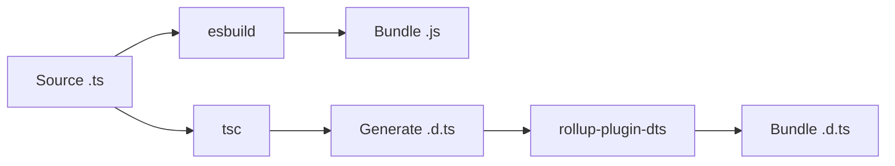

# TypeScript Bundling for NPM Packages Specification

## Overview

This specification addresses the challenge of bundling TypeScript type definitions for NPM packages in a monorepo environment where packages depend on shared workspace packages. The goal is to create self-contained packages that can be published to NPM without requiring consumers to install internal workspace dependencies.

## Problem Statement

### Current Situation

In our monorepo setup, packages have dependencies structured like:

```json
{
  "dependencies": {
    "@imgly/plugin-ai-generation-web": "workspace:*"
  }
}
```

These workspace dependencies are:
1. Bundled into the JavaScript output using esbuild (with `bundle: true`)
2. Referenced in TypeScript type definitions via import statements

### The Issue

When TypeScript generates `.d.ts` files, it preserves import statements:

```typescript
// In dist/fal-ai/RecraftV3.d.ts
import type { PropertyContext, ExtendPropertyContexts, CommonProviderConfiguration } from '@imgly/plugin-ai-generation-web';
```

After moving workspace dependencies to `devDependencies` (since JavaScript is bundled), the type imports fail when consumers install the package because `@imgly/plugin-ai-generation-web` is not available.

### Example Failure

```typescript
import FalAiImage from '@imgly/plugin-ai-image-generation-web/fal-ai';
// TypeScript error: Cannot find module '@imgly/plugin-ai-generation-web'
// Types like PropertyContext are unresolved
FalAiImage.RecraftV3({ proxyURL: 12 }); // No type checking
```

## Solution Architecture

### Approach: Bundle TypeScript Definitions

Similar to how we bundle JavaScript code, we need to bundle TypeScript type definitions to create self-contained `.d.ts` files that include all referenced types inline.

### Implementation Strategy

#### 1. Three-Stage Build Process



1. **JavaScript Bundling**: esbuild bundles all JavaScript including workspace dependencies
2. **Type Generation**: TypeScript compiler generates initial `.d.ts` files with imports
3. **Type Bundling**: rollup-plugin-dts bundles type definitions into self-contained files

#### 2. Build Configuration

##### Package Dependencies
```json
{
  "devDependencies": {
    "@imgly/plugin-ai-generation-web": "workspace:*",
    "rollup": "^4.0.0",
    "rollup-plugin-dts": "^6.0.0",
    "esbuild": "^0.19.0",
    "typescript": "^5.0.0"
  },
  "dependencies": {}
}
```

##### Build Script Update
```javascript
// scripts/build.mjs
import * as esbuild from 'esbuild';
import { rollup } from 'rollup';
import dts from 'rollup-plugin-dts';

// 1. Bundle JavaScript
await esbuild.build(config);

// 2. Generate type definitions
await execAsync('tsc --emitDeclarationOnly');

// 3. Bundle type definitions
const bundle = await rollup({
  input: './dist/index.d.ts',
  plugins: [dts()],
  external: ['@cesdk/cesdk-js'] // Keep peer dependencies external
});

await bundle.write({
  file: './dist/index.d.ts',
  format: 'es'
});
```

#### 3. Rollup Configuration for Multiple Entry Points

For packages with multiple exports (e.g., `./fal-ai`, `./open-ai`):

```javascript
// rollup.config.mjs
import dts from 'rollup-plugin-dts';

const entries = [
  './dist/index.d.ts',
  './dist/fal-ai/index.d.ts',
  './dist/open-ai/index.d.ts'
];

export default entries.map(input => ({
  input,
  output: {
    file: input,
    format: 'es'
  },
  plugins: [dts()],
  external: ['@cesdk/cesdk-js']
}));
```

### Alternative Solutions Considered

#### Option 2: Keep Types as Runtime Dependencies

**Approach**: Move `@imgly/plugin-ai-generation-web` back to `dependencies` but only for types.

**Pros**:
- Simple, no additional tooling
- Types always in sync

**Cons**:
- Consumers must install dependencies they don't need for runtime
- Increases package size and complexity
- Defeats the purpose of bundling

#### Option 3: Types-Only Package

**Approach**: Create `@imgly/plugin-types` containing all shared type definitions.

**Pros**:
- Single source of truth for types
- Small dependency

**Cons**:
- Requires maintaining separate package
- Version synchronization challenges
- Still requires a dependency

#### Option 4: Inline Types Manually

**Approach**: Copy shared types into each package.

**Pros**:
- No tooling required
- Full control

**Cons**:
- Code duplication
- Maintenance nightmare
- Synchronization issues

## Implementation Plan

### Phase 1: Proof of Concept
1. Set up rollup-plugin-dts in one package (e.g., `plugin-ai-image-generation-web`)
2. Verify bundled types work correctly
3. Test with npm pack and local installation

### Phase 2: Rollout
1. Create shared build utility for type bundling
2. Update all affected packages
3. Add CI validation to ensure types are bundled

### Phase 3: Optimization
1. Investigate type bundling performance
2. Consider caching strategies
3. Optimize for minimal bundle size

## Testing Strategy

### Unit Testing
```bash
# Build package
pnpm build

# Create tarball
npm pack

# Test installation
mkdir /tmp/test-types
cd /tmp/test-types
npm init -y
npm install ../path-to-tarball.tgz
```

### Type Validation
```typescript
// test-types.ts
import FalAiImage from '@imgly/plugin-ai-image-generation-web/fal-ai';

// Should have full type information
const config: Parameters<typeof FalAiImage.RecraftV3>[0] = {
  proxyURL: 'https://example.com' // Type checking should work
};
```

### CI Integration
```yaml
- name: Validate Type Bundling
  run: |
    pnpm build
    npm pack
    # Extract and validate no workspace imports in .d.ts files
    tar -xzf *.tgz
    ! grep -r "from '@imgly/plugin-.*workspace" package/dist
```

## Migration Guide

### For Package Maintainers

1. **Update package.json**:
   - Move workspace dependencies to `devDependencies`
   - Add rollup and rollup-plugin-dts to `devDependencies`

2. **Update build script**:
   - Add type bundling step after TypeScript compilation
   - Ensure all entry points are bundled

3. **Test thoroughly**:
   - Build and pack the package
   - Install in isolated environment
   - Verify type information is complete

### For Package Consumers

No changes required. Packages will work identically but without requiring additional dependencies.

## Performance Considerations

### Build Time Impact

Type bundling adds approximately 2-5 seconds per package to the build process. This is acceptable given the benefits.

### Bundle Size

Bundled type definitions are typically 20-30% larger than unbundled due to inlined types. This is negligible compared to the JavaScript bundle size.

### Development Workflow

During development with `SKIP_DTS=true`, type bundling can also be skipped to maintain fast iteration cycles.

## Future Enhancements

### 1. Selective Type Bundling
Only bundle types from workspace packages, keeping external dependencies as imports.

### 2. Type Tree-Shaking
Remove unused type definitions during bundling to minimize size.

### 3. Incremental Type Bundling
Cache and reuse bundled types when dependencies haven't changed.

## Conclusion

Bundling TypeScript type definitions solves the workspace dependency problem while maintaining type safety and developer experience. The rollup-plugin-dts approach provides a proven, maintainable solution that aligns with our existing JavaScript bundling strategy.